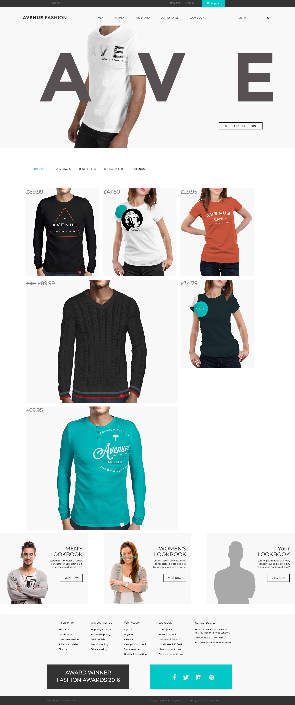

# first-project

My first ever project that I have developed.

To launch it, you'll have to install 3.9.1 version of Gulp and launch it:

So after you download the project open terminal and change direction to it.

(if you are using Mac OS or Linux use "sudo" in the beginning)
npm i -g gulp@3.9.1

npm i

gulp

